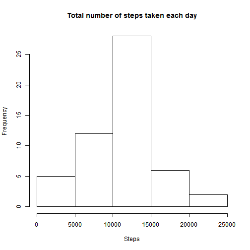
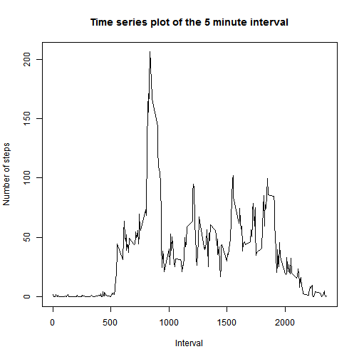
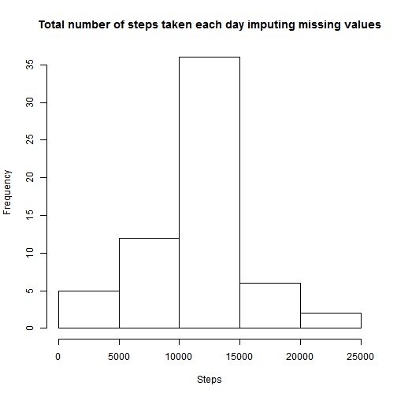
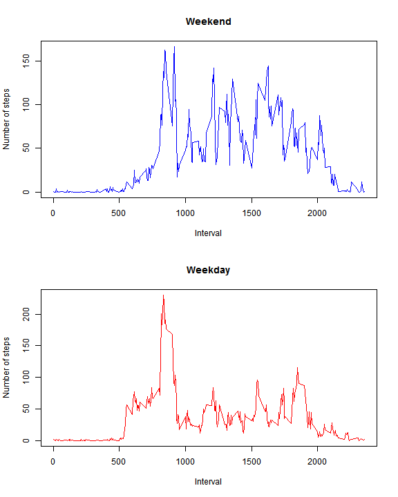

Reproducible Data: Course Project 1
===================================
This assignment makes use of data from a personal activity monitoring device. This device collects data at 5 minute intervals through out the day. The data consists of two months of data from an anonymous individual collected during the months of October and November, 2012 and include the number of steps taken in 5 minute intervals each day.

For this course project `data.table` and `dplry` packages are needed. So it is neccesary to install them before run the code.


### Loading and preprocessing the data

```r
activity=fread("activity.csv")
activity$date=as.Date(activity$date)
head(activity)
```

```
##    steps       date interval
## 1:    NA 2012-10-01        0
## 2:    NA 2012-10-01        5
## 3:    NA 2012-10-01       10
## 4:    NA 2012-10-01       15
## 5:    NA 2012-10-01       20
## 6:    NA 2012-10-01       25
```


### What is mean total number of steps taken per day?
For this part of the assignment, missing values in the dataset are ignored.

Calculating the total number of steps taken per day

```r
stepsDay=group_by(activity,date)
stepsDay=summarize(stepsDay,totalSteps=sum(steps))
```

Histogram of the total number of steps taken each day

```r
hist(stepsDay$totalSteps,
     xlab="Steps",main="Total number of steps taken each day")
```



Mean and median number of steps taken each day

```r
mean(stepsDay$totalSteps,na.rm=T) #Mean
```

```
## [1] 10766.19
```

```r
median(stepsDay$totalSteps,na.rm=T) #Median
```

```
## [1] 10765
```


###What is the average daily activity pattern?

Time series plot of the 5-minute interval (x-axis) and the average number of steps taken, averaged across all days (y-axis)

```r
intervalDay=group_by(activity,interval)
intervalDay=summarize(intervalDay,stepsInterval=mean(steps,na.rm=T))

#Plotting...
plot(intervalDay$interval,intervalDay$stepsInterval,type="l",
     main="Time series plot of the 5 minute interval",
     xlab="Interval",ylab="Number of steps")
```



Which 5-minute interval, on average across all the days in the dataset, contains the maximum number of steps?

```r
intervalDay$interval[intervalDay$stepsInterval==max(intervalDay$stepsInterval)]
```

```
## [1] 835
```


###Imputing missing values

Calculating the total number of missing values in the dataset

```r
nrow(activity)-sum(complete.cases(activity))
```

```
## [1] 2304
```

Devise a strategy for filling in all of the missing values in the dataset. The mean for 5-minute internal is considered for missing values

```r
activityComplete=activity #New dataset
        for (i in 1:nrow(activity)){
                if (is.na(activity$steps[i]==TRUE)){
                        interval=as.numeric(activityComplete$interval[i])
                        intervalMean=as.numeric(intervalDay[intervalDay$interval==interval,2])
                        activityComplete$steps[i]=intervalMean
                }
        }
```

New dataset is equal to the original dataset but with the missing data filled in

```r
head(activityComplete)
```

```
##        steps       date interval
## 1: 1.7169811 2012-10-01        0
## 2: 0.3396226 2012-10-01        5
## 3: 0.1320755 2012-10-01       10
## 4: 0.1509434 2012-10-01       15
## 5: 0.0754717 2012-10-01       20
## 6: 2.0943396 2012-10-01       25
```

Histogram of the total number of steps taken each day with the missing data filled in

```r
stepsDay2=group_by(activityComplete,date)
stepsDay2=summarize(stepsDay2,totalSteps=sum(steps))
hist(stepsDay2$totalSteps,
     xlab="Steps",main="Total number of steps taken each day imputing missing values")
```



Calculating the mean and median total number of steps taken per day

```r
mean(stepsDay2$totalSteps) #Mean
```

```
## [1] 10766.19
```

```r
median(stepsDay2$totalSteps) #Median
```

```
## [1] 10766.19
```


###Are there differences in activity patterns between weekdays and weekends?

New factor variable in the dataset with two levels - "weekday" and "weekend" indicating whether a given date is a weekday or weekend day.

```r
Sys.setlocale("LC_TIME", "English") #Weekdays in English
```

```
## [1] "English_United States.1252"
```

```r
activityComplete=mutate(activityComplete,weekday=as.factor(weekdays(activityComplete$date)))
levels(activityComplete$weekday)=c(rep("weekday",2),rep("weekend",2),rep("weekday",3))                                        
head(activityComplete)        
```

```
##       steps       date interval weekday
## 1 1.7169811 2012-10-01        0 weekday
## 2 0.3396226 2012-10-01        5 weekday
## 3 0.1320755 2012-10-01       10 weekday
## 4 0.1509434 2012-10-01       15 weekday
## 5 0.0754717 2012-10-01       20 weekday
## 6 2.0943396 2012-10-01       25 weekday
```

Panel plot containing a time series plot of the 5-minute interval (x-axis) and the average number of steps taken, averaged across all weekday days or weekend days (y-axis)

```r
###Subseting weekday
weekday=subset(activityComplete,weekday=="weekday") 
intervalWeekday=group_by(weekday,interval)
intervalWeekday=summarize(intervalWeekday,stepsInterval=mean(steps,na.rm=T))

###Subseting weekend
weekend=subset(activityComplete,weekday=="weekend")
intervalWeekend=group_by(weekend,interval)
intervalWeekend=summarize(intervalWeekend,stepsInterval=mean(steps,na.rm=T))

        ###Ploting...
        par(mfcol=c(2,1))
        
        ###top plot
        plot(intervalWeekend$interval,intervalWeekend$stepsInterval,
             main="Weekend",xlab="Interval",ylab="Number of steps",
             type="l",col="blue")
        
        ###bottom plot
        plot(intervalWeekday$interval,intervalWeekday$stepsInterval,
             main="Weekday",xlab="Interval",ylab="Number of steps",
             type="l",col="red")
```


