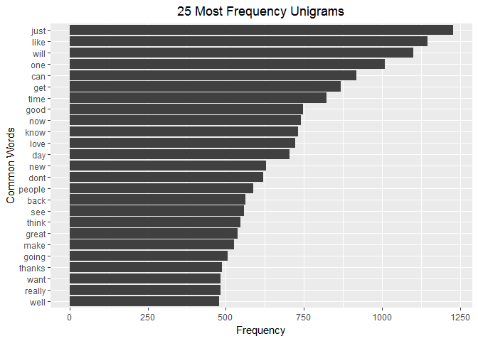
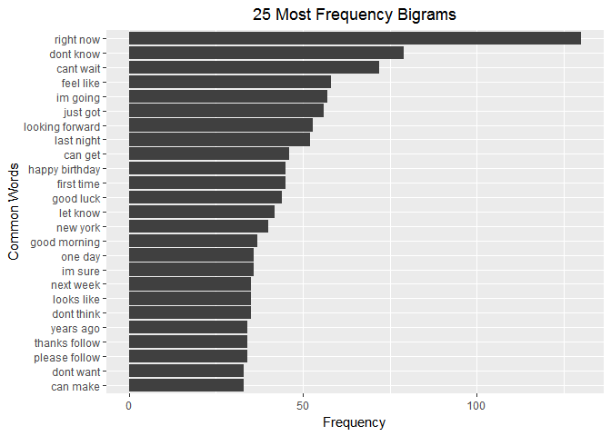
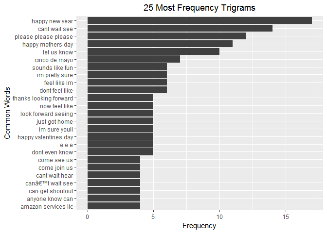

Next Word Predictor: Exploratory Data Analysis
==============================================

### Synopsis

This is the Milestone Report for the Coursera Data Science Capstone project. The goal of the capstone project is to create a predictive text model using a large text corpus of documents as training data.

This milestone report describes the major features of the training data with our exploratory data analysis and summarizes our plans for creating the predictive model.

### Getting data

The data consists of text files in four languages: English, Russian, German and Finnish. For each language, are three files namely blogs, news and twitter. Out of this four languages, I choose to analyze English as it is the only language that I am familiar with. We downloaded the zip file containing the text files from: <https://d396qusza40orc.cloudfront.net/dsscapstone/dataset/Coursera-SwiftKey.zip>

``` r
# Download and unzip the data to working directory
URL = 'https://d396qusza40orc.cloudfront.net/dsscapstone/dataset/Coursera-SwiftKey.zip'

if (!file.exists("Coursera-SwiftKey.zip")) {
    download.file(URL, destfile = "Coursera-SwiftKey.zip")
    unzip("Coursera-SwiftKey.zip")
}


# Read the blogs and Twitter data into R
blogs = readLines("final/en_US/en_US.blogs.txt", 
                  encoding = "UTF-8", skipNul = TRUE)
news = readLines("final/en_US/en_US.news.txt", 
                 encoding = "UTF-8", skipNul = TRUE)
```

    ## Warning in readLines("final/en_US/en_US.news.txt", encoding =
    ## "UTF-8", skipNul = TRUE): incomplete final line found on 'final/en_US/
    ## en_US.news.txt'

``` r
twitter = readLines("final/en_US/en_US.twitter.txt", 
                    encoding = "UTF-8", skipNul = TRUE)
```

The following codes compute file size, line and word count for the English language blog, news and twitter files.

``` r
# File sizes
blogs.size = file.info("./final/en_US/en_US.blogs.txt")$size / 1024 ^ 2
news.size = file.info("./final/en_US/en_US.news.txt")$size / 1024 ^ 2
twitter.size = file.info("./final/en_US/en_US.twitter.txt")$size / 1024 ^ 2

# Get words in files
library(stringi)
blogs.words <- stri_count_words(blogs)
news.words <- stri_count_words(news)
twitter.words <- stri_count_words(twitter)

# Summary of the data sets
summaryTable = data.frame(filename = c("blogs", "news", "twitter"),
                          file.size.MB = c(blogs.size, news.size, twitter.size),
                          num.lines = c(length(blogs), length(news),
                                        length(twitter)),
                          num.words = c(sum(blogs.words), sum(news.words),
                                        sum(twitter.words)),
                          mean.num.words = c(mean(blogs.words), mean(news.words),
                                             mean(twitter.words)))

summaryTable
```

    ##   filename file.size.MB num.lines num.words mean.num.words
    ## 1    blogs     200.4242    899288  37546246       41.75108
    ## 2     news     196.2775     77259   2674536       34.61779
    ## 3  twitter     159.3641   2360148  30093410       12.75065

### Cleaning Data

Before performing exploratory analysis, we are going to clean the data. This involves removing URLs, special characters, punctuations, numbers, excess whitespace, stopwords, and changing the text to lower case. Since the data sets are quite large, we have choosen 0.5% of the data to demonstrate the data cleaning and exploratory analysis (we tried with 2% and 1% but the processing capability was very slow).

``` r
library (tm)
```

    ## Warning: package 'tm' was built under R version 3.3.3

    ## Loading required package: NLP

``` r
set.seed(1211)
# Getting a sample of the three datasets and removing weird characters
blogs.sample = sample(blogs, length(blogs)*0.005)
blogs.sample = sapply(blogs.sample, function(x) iconv (enc2utf8(x), sub ="byte")) 

news.sample = sample(news, length(news)*0.005)
news.sample = sapply(news.sample, function(x) iconv (enc2utf8(x), sub ="byte"))

twitter.sample = sample(twitter, length(twitter)*0.005)
twitter.sample = sapply(twitter.sample, function(x) iconv (enc2utf8(x), sub ="byte"))

# Creating corpus
data.sample = c(blogs.sample,news.sample,twitter.sample)
corpus = VCorpus(VectorSource(data.sample))

example = corpus[[2]]
```

Number of lines:

``` r
length(data.sample) #number of lines
```

    ## [1] 16682

Number of words:

``` r
sum(stri_count_words(data.sample)) #number of words
```

    ## [1] 358531

``` r
# Cleaning the data and removing all weird characters
corpus = tm_map(corpus, content_transformer(tolower)) #convert to lower case
corpus = tm_map(corpus, content_transformer(removePunctuation)) #remove all punctuation
corpus = tm_map(corpus, content_transformer(removeNumbers)) #remove all numbers
corpus = tm_map(corpus, content_transformer(removeWords), stopwords("english")) #Remove stopwords
corpus = tm_map(corpus, content_transformer(stripWhitespace)) #remove all white spaces
corpus = tm_map(corpus, content_transformer(PlainTextDocument)) #convert to plain text document
```

In order to see the diference between raw and clean data, we have saved an example of the dataset before cleaning data:

``` r
inspect(example)
```

    ## <<PlainTextDocument>>
    ## Metadata:  7
    ## Content:  chars: 749
    ## 
    ## Thus the depopulation of white farms due to this ongoing violence is also causing a knock-on effect, with squatter towns growing larger every time jobless farm workers move away from desolate farms after such murders. Less than one percent of the entire South African land surface is now used for irrigated crop-production, causing local food prices to triple this past year. In 1994 about 6% of the entire SA land-surface was still used by commercial farmers: the rest of the country is not suitable for crop-growing for the marketplace.â<U+0080>Ever since my retirement as a South African journalist, I have been recording these attacks from a great variety of South African sources on m y own website.â<U+0080> Adriana Stuijt retired South African Journalist

And this is the text with cleaning data done:

``` r
inspect(corpus[[2]])
```

    ## <<PlainTextDocument>>
    ## Metadata:  7
    ## Content:  chars: 565
    ## 
    ## thus depopulation white farms due ongoing violence also causing knockon effect squatter towns growing larger every time jobless farm workers move away desolate farms murders less one percent entire south african land surface now used irrigated cropproduction causing local food prices triple past year entire sa landsurface still used commercial farmers rest country suitable cropgrowing marketplaceâ<U+0080>ever since retirement south african journalist recording attacks great variety south african sources m y websiteâ<U+0080> adriana stuijt retired south african journalist

### Word Analysis

``` r
library (RWeka)
```

    ## Warning: package 'RWeka' was built under R version 3.3.3

``` r
library(ggplot2)
```

    ## 
    ## Attaching package: 'ggplot2'

    ## The following object is masked from 'package:NLP':
    ## 
    ##     annotate

``` r
getFreq = function(tdm) {
  freq = sort(rowSums(as.matrix(tdm)), decreasing = TRUE)
  return(data.frame(word = names(freq), freq = freq))
}

BigramTokenizer = function(x) NGramTokenizer(x, Weka_control(min = 2, max = 2))
TrigramTokenizer = function(x) NGramTokenizer(x, Weka_control(min = 3, max = 3))

# Get frequencies of most common n-grams in data sample
freq1 = getFreq(removeSparseTerms(TermDocumentMatrix(corpus), 0.999))
freq2 = getFreq(removeSparseTerms(TermDocumentMatrix(corpus,control = list(tokenize = BigramTokenizer)), 0.9999))
freq3 = getFreq(removeSparseTerms(TermDocumentMatrix(corpus, control = list(tokenize = TrigramTokenizer)), 0.9999))
```

##### Unigram Plot:

``` r
ggplot(freq1[1:25,], aes(reorder(word, freq), freq)) + 
    geom_bar(stat = "identity", fill = 'grey25') + 
    coord_flip() + 
    labs(title = '25 Most Frequency Unigrams', x = 'Common Words', y = "Frequency") +
    theme(plot.title = element_text(hjust = 0.5))
```



##### Bigram Plot:

``` r
ggplot(freq2[1:25,], aes(reorder(word, freq), freq)) + 
    geom_bar(stat = "identity", fill = 'grey25') + 
    coord_flip() + 
    labs(title = '25 Most Frequency Bigrams', x = 'Common Words', y = "Frequency") +
    theme(plot.title = element_text(hjust = 0.5))
```



##### Trigram Plot:

``` r
ggplot(freq3[1:25,], aes(reorder(word, freq), freq)) + 
    geom_bar(stat = "identity", fill = 'grey25') + 
    coord_flip() + 
    labs(title = '25 Most Frequency Trigrams', x = 'Common Words', y = "Frequency") +
    theme(plot.title = element_text(hjust = 0.5))
```



### Prediction Algorithm Plans

Moving forward, the project goal is to develop a natural language prediction algorithm and app. For example, if a user were to type, "I want to go to the .", the app would suggest the three most likely words that would replace ".".

After the dictionaries have been established, an app will be developed allowing the user to enter text. The app will suggest the three most likely words to come next in the text for the text type, based on these rules:

1.  If the supplied text is greater than 2 words, take the last three words of the text and search the trigram/unigram pairs.
2.  If the supplied text is 2 words, take the two words and search the bigram/unigram pairs.
3.  If the supplied text is 1 word, search for that word in the unigram/unigram pairs.

A few observations can be done from the above analysis: \* The n-gram shows a good predictive results even with a small sample size. \* The processing capability is very slow although the small sample used. \* Words produced by Bigrams and Trigrams analysis make more sense than Unigram.
