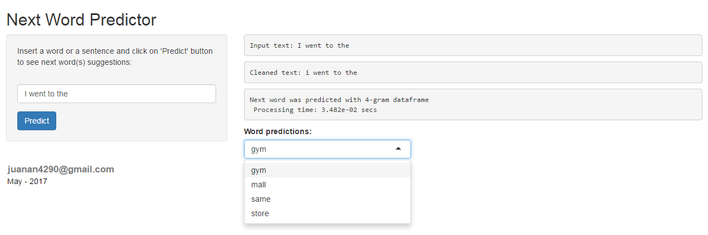

Next Word Predictor Application
===============================

Overview
--------

This is the final project for the Coursera Data Science Capstone. The goal of the capstone project is to create a predictive text model using a large text corpus of documents as training data.

For example, if a user types:

*"I went to the ..."*

the app would suggest the three most likely words that would replace "...", i.e. *gym, store or mall.*

-   The source codes of the app, the N-gram datasets and the algorithm available on GitHub repo at: <https://github.com/Juanan4290/Rprojects/tree/master/DataProducts/NextWordPredictor/R>

-   The shiny application developed for this course is available at: <https://juanan4290.shinyapps.io/nextwordpredictor/>

N-grams summary
---------------

Head of *"fourgrams"* and *"trigrams"* data frames loaded by Next Word Predictor App:

    ##                    Word Freq                 Prob
    ## 1 thanks for the follow 2027 0.000207001660098168
    ## 2     thanks for the rt 1115 0.000113866231381084
    ## 3      cant wait to see 1058 0.000108045267086266
    ## 4     thank you for the 1021 0.000104266746403665
    ## 5        is going to be  768 7.84298347091233e-05
    ## 6     thank you so much  726 7.41407031234682e-05

    ##                 Word Freq                 Prob
    ## 1     thanks for the 7830 0.000799616674182859
    ## 2 looking forward to 2863 0.000292375803088828
    ## 3       cant wait to 2835 0.000289516382031725
    ## 4      thank you for 2812 0.000287167571877676
    ## 5         i love you 2770  0.00028287844029202
    ## 6     for the follow 2545 0.000259900949654582

Application Funcionality
------------------------

Main steps to achieve next word predictions:

Extra space

1.  Loading 4 data frames contained **n-grams** combinations with 4-words, 3-words, 2-words, and 1-word previously generated.
2.  Reading user input (a word or sentence).
3.  Cleaning user input (lowering, tokenization of input words: the last four)
4.  Call to prediction model function:
    -   Search in the **fourgram** data frame. If found, shows top 5 most probable matches. Otherwise:
    -   Search in the **trigram** data frame, by the same way above. Otherwise:
    -   Search in **bigram** data frame, by the same way above.
    -   Else, at last, if none matching, displays the most frequent words in the **unigram** data frame.

Viewing the Shiny App
---------------------

This is how the Next Word Predictor Application looks like:

In the left side you can insert a word or sentence and once you click on **Predict** button or press Enter the app will display some words suggested and other information like which N-gram next word was predict with, time invested to procces the algorithm or cleaned text for prediction.
