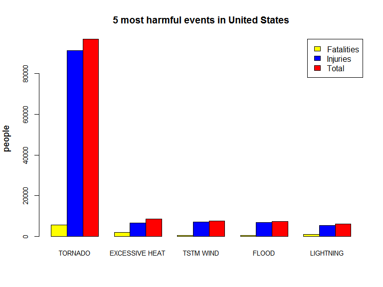
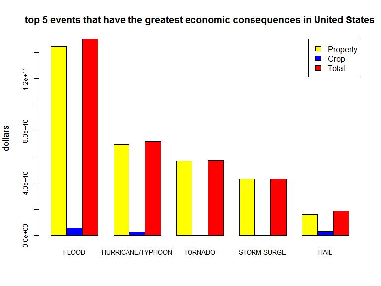

Most harmful events across the United States
===================================
Author: **Juan Antonio Morales** (juanan4290@gmail.com)

Date: January 12, 2017

### Synopsis

In this report we aim to explore the U.S. National Oceanic and Atmospheric Administration's (NOAA) storm database. This database tracks characteristics of major storms and weather events in the United States from 1950 to November 2011, including when and where they occur, as well as estimates of any fatalities, injuries, and property damage. Our specific goal is to know what types of wheather events are most harmful with respect to population health and which ones have the greatest economic consequences.

### Data Processing

From the [National Weather Service Storm Data Documentation](http://www.noaa.gov/) we obtained data on storms occured across the United States. The events in the database start in the year 1950 and end in November 2011. In the earlier years of the database there are generally fewer events recorded, most likely due to a lack of good records. More recent years should be considered more complete.

We first read data from the raw text file included in the zip archive. For reading the data we are going to use the function `fread`of the `data.table` package. `dplry` and `ggplot2` packages are going to be required for the data analysis.

``` r
StormData=fread("repdata%2Fdata%2FStormData.csv")
```

    ## 
    Read 22.7% of 967216 rows
    Read 43.4% of 967216 rows
    Read 57.9% of 967216 rows
    Read 76.5% of 967216 rows
    Read 83.7% of 967216 rows
    Read 902297 rows and 37 (of 37) columns from 0.523 GB file in 00:00:07

    ## Warning in fread("repdata%2Fdata%2FStormData.csv"): Read less rows (902297)
    ## than were allocated (967216). Run again with verbose=TRUE and please
    ## report.

``` r
StormData=as.data.frame(StormData)
```

After reading data, we check the first few rows ih the dataset. There are 902,297 rows.

``` r
str(StormData)
```

    ## 'data.frame':    902297 obs. of  37 variables:
    ##  $ STATE__   : num  1 1 1 1 1 1 1 1 1 1 ...
    ##  $ BGN_DATE  : chr  "4/18/1950 0:00:00" "4/18/1950 0:00:00" "2/20/1951 0:00:00" "6/8/1951 0:00:00" ...
    ##  $ BGN_TIME  : chr  "0130" "0145" "1600" "0900" ...
    ##  $ TIME_ZONE : chr  "CST" "CST" "CST" "CST" ...
    ##  $ COUNTY    : num  97 3 57 89 43 77 9 123 125 57 ...
    ##  $ COUNTYNAME: chr  "MOBILE" "BALDWIN" "FAYETTE" "MADISON" ...
    ##  $ STATE     : chr  "AL" "AL" "AL" "AL" ...
    ##  $ EVTYPE    : chr  "TORNADO" "TORNADO" "TORNADO" "TORNADO" ...
    ##  $ BGN_RANGE : num  0 0 0 0 0 0 0 0 0 0 ...
    ##  $ BGN_AZI   : chr  "" "" "" "" ...
    ##  $ BGN_LOCATI: chr  "" "" "" "" ...
    ##  $ END_DATE  : chr  "" "" "" "" ...
    ##  $ END_TIME  : chr  "" "" "" "" ...
    ##  $ COUNTY_END: num  0 0 0 0 0 0 0 0 0 0 ...
    ##  $ COUNTYENDN: logi  NA NA NA NA NA NA ...
    ##  $ END_RANGE : num  0 0 0 0 0 0 0 0 0 0 ...
    ##  $ END_AZI   : chr  "" "" "" "" ...
    ##  $ END_LOCATI: chr  "" "" "" "" ...
    ##  $ LENGTH    : num  14 2 0.1 0 0 1.5 1.5 0 3.3 2.3 ...
    ##  $ WIDTH     : num  100 150 123 100 150 177 33 33 100 100 ...
    ##  $ F         : chr  "3" "2" "2" "2" ...
    ##  $ MAG       : num  0 0 0 0 0 0 0 0 0 0 ...
    ##  $ FATALITIES: num  0 0 0 0 0 0 0 0 1 0 ...
    ##  $ INJURIES  : num  15 0 2 2 2 6 1 0 14 0 ...
    ##  $ PROPDMG   : num  25 2.5 25 2.5 2.5 2.5 2.5 2.5 25 25 ...
    ##  $ PROPDMGEXP: chr  "K" "K" "K" "K" ...
    ##  $ CROPDMG   : num  0 0 0 0 0 0 0 0 0 0 ...
    ##  $ CROPDMGEXP: chr  "" "" "" "" ...
    ##  $ WFO       : chr  "" "" "" "" ...
    ##  $ STATEOFFIC: chr  "" "" "" "" ...
    ##  $ ZONENAMES : chr  "" "" "" "" ...
    ##  $ LATITUDE  : num  3040 3042 3340 3458 3412 ...
    ##  $ LONGITUDE : num  8812 8755 8742 8626 8642 ...
    ##  $ LATITUDE_E: num  3051 0 0 0 0 ...
    ##  $ LONGITUDE_: num  8806 0 0 0 0 ...
    ##  $ REMARKS   : chr  "" "" "" "" ...
    ##  $ REFNUM    : num  1 2 3 4 5 6 7 8 9 10 ...

``` r
head(StormData[,1:8])
```

    ##   STATE__           BGN_DATE BGN_TIME TIME_ZONE COUNTY COUNTYNAME STATE
    ## 1       1  4/18/1950 0:00:00     0130       CST     97     MOBILE    AL
    ## 2       1  4/18/1950 0:00:00     0145       CST      3    BALDWIN    AL
    ## 3       1  2/20/1951 0:00:00     1600       CST     57    FAYETTE    AL
    ## 4       1   6/8/1951 0:00:00     0900       CST     89    MADISON    AL
    ## 5       1 11/15/1951 0:00:00     1500       CST     43    CULLMAN    AL
    ## 6       1 11/15/1951 0:00:00     2000       CST     77 LAUDERDALE    AL
    ##    EVTYPE
    ## 1 TORNADO
    ## 2 TORNADO
    ## 3 TORNADO
    ## 4 TORNADO
    ## 5 TORNADO
    ## 6 TORNADO

### Results

#### Population health analysis

The columns we are interested in are the `FATALITIES` and `INJURIES` variables, which contain the number of dead and injured people. First, we are going to subset the dataset with the variables we are interested in.

``` r
#Subsetting most harmful events for population health
StormHealth=select(StormData,c(EVTYPE,FATALITIES,INJURIES))
StormHealth$EVTYPE=as.factor(StormHealth$EVTYPE)
        
#Grouping for types of events
StormHealth5=group_by(StormHealth,EVTYPE)
StormHealth5=summarize(StormHealth5,FATALITIES=sum(FATALITIES),
                       INJURIES=sum(INJURIES),TOTAL=sum(c(FATALITIES,INJURIES)))

#Ordering according to number of total fatalities and injuries
StormHealth5=StormHealth5[with(StormHealth5,order(-TOTAL)),][1:5,] #5 most harmful events
MostHarmful=as.character(StormHealth5$EVTYPE[1]) #Most harmful event
```

In order to show the 5 most harmful events respect to population health, we can make a barplot in terms of number of people dead or injured by type of event.

``` r
#Data for plotting
data=as.data.frame(t(StormHealth5[,2:4]))
names(data)=StormHealth5$EVTYPE

barplot(as.matrix(data),beside=T,main="5 most harmful events in United States",
             ylab="people",col=c("yellow","blue","red"),cex.axis=0.8,cex.names=0.8,cex.lab=1.1)

legend("topright", c("Fatalities","Injuries","Total"),fill=c("yellow","blue","red"))
```



According to barplot, we can easyly see that the **most harmful type of event across the United States is *TORNADO***

#### Economic consequences

In this case, the columns we are interested in are the `PROPDMG` and `CROPDMG` variables, which contain the economic property and crop consequences. `PROPDMGEXP` and `CROPDMGEXP`columns have the exponent of the `PROPDMG` and `CROPDMG` variables.

First, we are going to subset the dataset with the variables we are interested in.

``` r
#Subsetting 5 types of events that have the greatest economic consequences
StormEc=select(StormData,c(EVTYPE,PROPDMG,PROPDMGEXP,CROPDMG,CROPDMGEXP))        
  #Some variables have to be factor in order to do some changes
  StormEc$EVTYPE=as.factor(StormEc$EVTYPE)
  StormEc$PROPDMGEXP=as.factor(StormEc$PROPDMGEXP)
  StormEc$CROPDMGEXP=as.factor(StormEc$CROPDMGEXP)
```

We have to replace the key letter in the exponent column with the correct number.

``` r
#Replacing exponent code for exponent number
StormEc$PROPDMGEXP=mapvalues(StormEc$PROPDMGEXP,
                   c("K","M","","B","m","+","0","5","6","?","4","2","3","h","7","H","-","1","8"), 
                   c(1e3,1e6,1,1e9,1e6,1,1,1e5,1e6,1,1e4,1e2,1e3,1,1e7,1e2,1,10,1e8))

StormEc$CROPDMGEXP=mapvalues(StormEc$CROPDMGEXP,
                   c("","M","K","m","B","?","0","k","2"),
                   c( 1,1e6,1e3,1e6,1e9,1,1,1e3,1e2))
        
#Transforming PROPDMG and CROPDMG in the correct number with the exponent
StormEc$PROPDMGEXP=as.numeric(levels(StormEc$PROPDMGEXP))[StormEc$PROPDMGEXP] #transform a factor to numeric                                                                 
StormEc$PROPDMG=StormEc$PROPDMG*StormEc$PROPDMGEXP

StormEc$CROPDMGEXP=as.numeric(levels(StormEc$CROPDMGEXP))[StormEc$CROPDMGEXP]

StormEc$CROPDMG=StormEc$CROPDMG*StormEc$CROPDMGEXP
       
#Subsetting 5 most harmful events for economic consequences
StormEc=select(StormEc,c(EVTYPE,PROPDMG,CROPDMG))
```

In order to show the 5 type of events that have the greatest economic consequences, we can make a barplot in terms of property and crop economic consequences by type of event.

``` r
#Grouping for types of events
StormEc5=group_by(StormEc,EVTYPE)
StormEc5=summarize(StormEc5,property=sum(PROPDMG),crop=sum(CROPDMG),
                   total=sum(c(PROPDMG,CROPDMG)))
        
#Ordering according to economic consequences
StormEc5=StormEc5[with(StormEc5,order(-total)),][1:5,]
MostHarmfulEc=as.character(StormEc5$EVTYPE[1])
        
#Plotting...
dataEc=as.data.frame(t(StormEc5[,2:4]))
names(dataEc)=StormEc5$EVTYPE
                
barplot(as.matrix(dataEc),beside=T,
        main="top 5 events that have the greatest economic consequences in United States",
        ylab="dollars",col=c("yellow","blue","red"),cex.axis=0.8,cex.names=0.8,cex.lab=1.1)
                
legend("topright", c("Property","Crop","Total"),fill=c("yellow","blue","red"))
```



According to barplot, we can say that the **type of event that has the greatest economic consequences is FLOOD**
