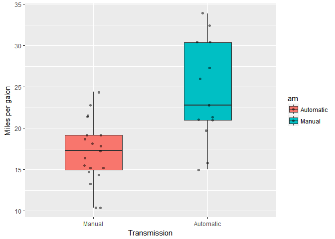
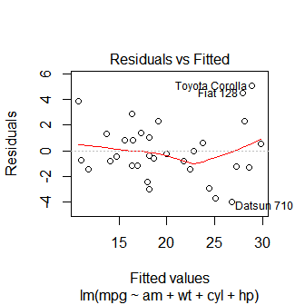
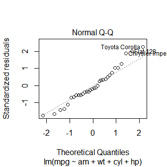
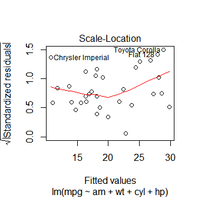
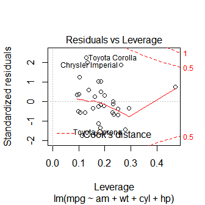

Motor Trend Car Analysis
========================

### Summary

In this project we are going to work for *Motor Trend*, a magazine about the automobile industry. They are interested in exploring the relationship between a set of variables and miles per gallon. They are particularly interested in the following two questions:

1.  Is an automatic or manual transmission better for MPG?
2.  Quantify the MPG difference between automatic and manual transmissions

### Exploratory Data Analysis

The data was extracted from the 1974 Motor Trend US magazine, and comprises fuel consumption and 10 aspects of automobile design and performance for 32 automobiles (1973-74 models).

``` r
library(datasets) 
data(mtcars)
```

Some exploratory data analysis:

``` r
str(mtcars)
```

    ## 'data.frame':    32 obs. of  11 variables:
    ##  $ mpg : num  21 21 22.8 21.4 18.7 18.1 14.3 24.4 22.8 19.2 ...
    ##  $ cyl : num  6 6 4 6 8 6 8 4 4 6 ...
    ##  $ disp: num  160 160 108 258 360 ...
    ##  $ hp  : num  110 110 93 110 175 105 245 62 95 123 ...
    ##  $ drat: num  3.9 3.9 3.85 3.08 3.15 2.76 3.21 3.69 3.92 3.92 ...
    ##  $ wt  : num  2.62 2.88 2.32 3.21 3.44 ...
    ##  $ qsec: num  16.5 17 18.6 19.4 17 ...
    ##  $ vs  : num  0 0 1 1 0 1 0 1 1 1 ...
    ##  $ am  : num  1 1 1 0 0 0 0 0 0 0 ...
    ##  $ gear: num  4 4 4 3 3 3 3 4 4 4 ...
    ##  $ carb: num  4 4 1 1 2 1 4 2 2 4 ...

For the analysis we have to transform the class of some variables variable into a factor:

``` r
mtcars$cyl <- factor(mtcars$cyl)
mtcars$vs <- factor(mtcars$vs)
mtcars$gear <- factor(mtcars$gear)
mtcars$carb <- factor(mtcars$carb)
mtcars$am <- factor(mtcars$am,labels=c('Automatic','Manual'))
```

### 1.Is an automatic or manual transmission better for MPG?

In Appendix 1 we can see a boxplot of MPG by transmission types (Appendix 2). According to Appendix 2 boxplot, it seems that manual transmission is better in miles/(US) gallon than automatic transmission. We can do a t-test to reject the null hypothesis (there is no difference in MPG between manual and automatic transmission).

``` r
t.test(mpg ~ am,data=mtcars)
```

    ## 
    ##  Welch Two Sample t-test
    ## 
    ## data:  mpg by am
    ## t = -3.7671, df = 18.332, p-value = 0.001374
    ## alternative hypothesis: true difference in means is not equal to 0
    ## 95 percent confidence interval:
    ##  -11.280194  -3.209684
    ## sample estimates:
    ## mean in group Automatic    mean in group Manual 
    ##                17.14737                24.39231

Based on t-test, **p-value = 0.001374** &lt; 0.05, so we can reject the null hypothesis and hence **manual transmission is better than automatic transmission for MPG.**

### 2.Quantify the MPG difference between automatic and manual transmissions

To quantify the MPG difference between automatic and manual transmissions we are going to fit a lineal model between **mpg** and **am** variables.

``` r
fit1=lm(mpg ~ am,data=mtcars)
summary(fit1)
```

    ## 
    ## Call:
    ## lm(formula = mpg ~ am, data = mtcars)
    ## 
    ## Residuals:
    ##     Min      1Q  Median      3Q     Max 
    ## -9.3923 -3.0923 -0.2974  3.2439  9.5077 
    ## 
    ## Coefficients:
    ##             Estimate Std. Error t value Pr(>|t|)    
    ## (Intercept)   17.147      1.125  15.247 1.13e-15 ***
    ## amManual       7.245      1.764   4.106 0.000285 ***
    ## ---
    ## Signif. codes:  0 '***' 0.001 '**' 0.01 '*' 0.05 '.' 0.1 ' ' 1
    ## 
    ## Residual standard error: 4.902 on 30 degrees of freedom
    ## Multiple R-squared:  0.3598, Adjusted R-squared:  0.3385 
    ## F-statistic: 16.86 on 1 and 30 DF,  p-value: 0.000285

From this model, we can say that **automatic run at 17.15 mpg, while manual have 7.24 more mpg** and about 35.98% of the variance is explained by this model.

Multivariable linear regression model:

``` r
fit2=lm(mpg ~ am + wt, data=mtcars)
fit3=lm(mpg ~ am + wt + cyl, data=mtcars)
fit4=lm(mpg ~ am + wt + cyl + hp, data=mtcars)
anova(fit1,fit2,fit3,fit4)
```

    ## Analysis of Variance Table
    ## 
    ## Model 1: mpg ~ am
    ## Model 2: mpg ~ am + wt
    ## Model 3: mpg ~ am + wt + cyl
    ## Model 4: mpg ~ am + wt + cyl + hp
    ##   Res.Df    RSS Df Sum of Sq       F   Pr(>F)    
    ## 1     30 720.90                                  
    ## 2     29 278.32  1    442.58 76.1924 3.32e-09 ***
    ## 3     27 182.97  2     95.35  8.2077 0.001725 ** 
    ## 4     26 151.03  1     31.94  5.4991 0.026935 *  
    ## ---
    ## Signif. codes:  0 '***' 0.001 '**' 0.01 '*' 0.05 '.' 0.1 ' ' 1

The final model:

``` r
summary(fit4)
```

    ## 
    ## Call:
    ## lm(formula = mpg ~ am + wt + cyl + hp, data = mtcars)
    ## 
    ## Residuals:
    ##     Min      1Q  Median      3Q     Max 
    ## -3.9387 -1.2560 -0.4013  1.1253  5.0513 
    ## 
    ## Coefficients:
    ##             Estimate Std. Error t value Pr(>|t|)    
    ## (Intercept) 33.70832    2.60489  12.940 7.73e-13 ***
    ## amManual     1.80921    1.39630   1.296  0.20646    
    ## wt          -2.49683    0.88559  -2.819  0.00908 ** 
    ## cyl6        -3.03134    1.40728  -2.154  0.04068 *  
    ## cyl8        -2.16368    2.28425  -0.947  0.35225    
    ## hp          -0.03211    0.01369  -2.345  0.02693 *  
    ## ---
    ## Signif. codes:  0 '***' 0.001 '**' 0.01 '*' 0.05 '.' 0.1 ' ' 1
    ## 
    ## Residual standard error: 2.41 on 26 degrees of freedom
    ## Multiple R-squared:  0.8659, Adjusted R-squared:  0.8401 
    ## F-statistic: 33.57 on 5 and 26 DF,  p-value: 1.506e-10

This model explains 86.59% of the variance. It may be concluded that on average, manual transmissions have 1.81 more mpg than automatic.

### Appendix

#### Appendix 1:

``` r
library(ggplot2)
g=ggplot(mtcars, aes(x=am,y=mpg,fill=am)) +
        geom_boxplot(varwidth=T,width=0.5)+
        geom_jitter(shape=16,position=position_jitter(0.1),alpha=0.5)+
        labs(x="Transmission",y="Miles per galon")+
        scale_x_discrete(labels=c("Manual","Automatic"))
g  
```



#### Appendix 2:

Residual plots:

``` r
plot(fit4)
```


