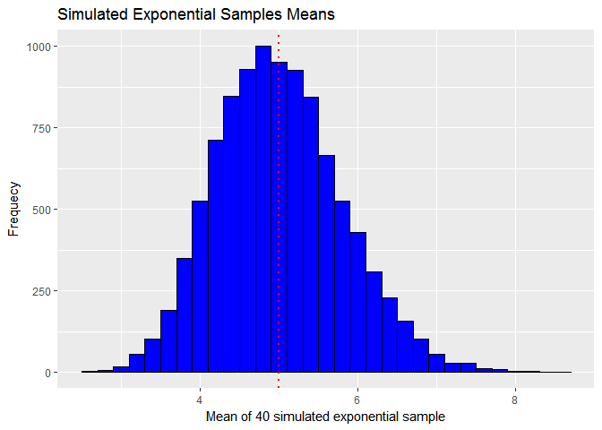

Central Limit Theorem
=====================

### Overview:

In this project we are going to investigate the exponential distribution in R and compare it with the Central Limit Theorem. In the exponential distribution `lambda` is the rate parameter. The mean of exponential distribution is 1/lambda and the standard deviation is also 1/lambda.

### Simulations:

The exponential distribution is simulated in R with `rexp(n,lambda)`, where lambda=0.2, sample size n is 40, and the number of simulation is 10000 times. The 10000 sample means are stored in `SampleMean`.

``` r
#Inputs
n=40                            #Sample Size
B=10000                          #Number of simulations

lambda=0.2                      #Lambda for exponential distributions
ExpMean=1/0.2                   #Theoretical mean and sd of the exponential distribution
ExpVariance=(1/lambda)^2/n      #Theoretical variance of the exponential distribution
```

In order to be able to reproduce the data in the future, `set.seed` is needed for this part of the project:

``` r
set.seed=0
```

``` r
SampleMean=NULL

#Simulations
for (i in 1:B) {
        sample=rexp(n,lambda)
        SampleMean=c(SampleMean,mean(sample))
} 
```

These are the first 6 of the `SampleMean` vector:

``` r
head(SampleMean)
```

    ## [1] 4.506210 6.656129 5.071457 5.176161 3.537697 5.273700

### Sample Mean versus Theoretical Mean:

We can show the sample mean and theoretical mean:

``` r
SimMean=round(mean(SampleMean),4)
ExpMean
```

    ## [1] 5

In this plot, we can see the mean distribution by simulations and the theoretical mean of the exponential distribution:

``` r
library(ggplot2)
SampleMean <- as.data.frame(SampleMean)
g <- ggplot(SampleMean, aes(x=SampleMean))
g <- g + geom_histogram(binwidth = .2, color="black", fill="blue") +
    geom_vline(xintercept = ExpMean, color="red", size=1, linetype=3) +
    labs(x="Mean of 40 simulated exponential sample", y= "Frequecy", 
         title="Simulated Exponential Samples Means")
g
```



### Sample Variance versus Theoretical Variance:

In the same way we have done with the mean, we can do with the variance:

``` r
SampleVar=as.numeric(round(var(SampleMean),4))
SampleVar
```

    ## [1] 0.6364

``` r
ExpVariance
```

    ## [1] 0.625

Variance distribution by simulations and theoretical variance of exponencial distribution:

``` r
table=matrix(c(ExpMean, SimMean, ExpVariance,SampleVar),
                ncol = 2, byrow=TRUE)
colnames(table)=c("Theroetical","Sample Mean")
rownames(table)=c("Mean","Variance")
table=as.table(table)
table
```

    ##          Theroetical Sample Mean
    ## Mean          5.0000      5.0039
    ## Variance      0.6250      0.6364

Acording to above table, both theoretical mean and sample mean are very close due in part to the large number of simulations performed. The same happens with te theoretical variance and sample variance although in this case there is more dispersion than in the case of the mean.

### Distribution:

We are going to make an histogram with the sample means simulated and we will add the density curve of the normal distribution in order to compare both density graphs:

``` r
g <- ggplot(SampleMean, aes(x=SampleMean))
g <- g + geom_histogram(binwidth = .2, color="black", fill="blue" , aes(y=..density..))+
         stat_function(fun=dnorm, args=list(mean=ExpMean, sd=sqrt(ExpVariance)), 
                       color="red", size =1) +
         scale_x_continuous(breaks=seq(0,8,by=1))+
         labs(x="Mean of 40 simulated exponential sample", y= "Prob.", 
         title="Density of Simulated Exponential Samples Means")
g
```


The plot shows that the distribution is approximately normal (red curve).
