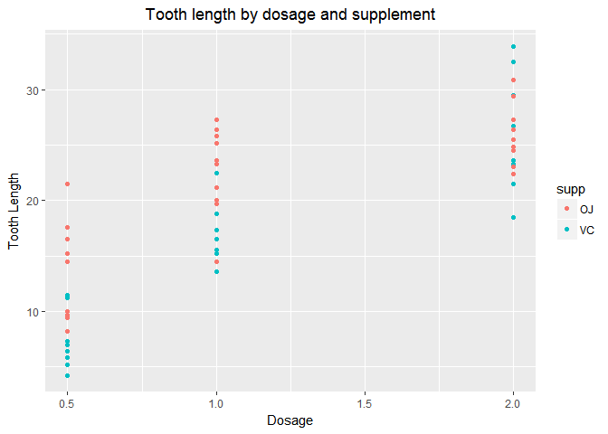

Tooth Growth T-tests
====================

### Overview:

In the second part of the project, we are going to analyze the ToothGrowth data in the R datasets package

### Load the ToothGrowth data and perform some basic exploratory data analyses

``` r
data("ToothGrowth")
head(ToothGrowth)
```

    ##    len supp dose
    ## 1  4.2   VC  0.5
    ## 2 11.5   VC  0.5
    ## 3  7.3   VC  0.5
    ## 4  5.8   VC  0.5
    ## 5  6.4   VC  0.5
    ## 6 10.0   VC  0.5

There are 3 variables and 60 observations in the ToothGrowth datasets. The three variables of the dataset are `length`, `supplement` and `dose`.

``` r
str(ToothGrowth)
```

    ## 'data.frame':    60 obs. of  3 variables:
    ##  $ len : num  4.2 11.5 7.3 5.8 6.4 10 11.2 11.2 5.2 7 ...
    ##  $ supp: Factor w/ 2 levels "OJ","VC": 2 2 2 2 2 2 2 2 2 2 ...
    ##  $ dose: num  0.5 0.5 0.5 0.5 0.5 0.5 0.5 0.5 0.5 0.5 ...

``` r
unique(ToothGrowth$dose)
```

    ## [1] 0.5 1.0 2.0

There are 3 levels for `supp`: `OJ` (orange juice) and `VC` (Vitamin C). For dose variable there are 3 values: 0.5, 1 and 2 mg.

### Summary of the data

``` r
summary(ToothGrowth)
```

    ##       len        supp         dose      
    ##  Min.   : 4.20   OJ:30   Min.   :0.500  
    ##  1st Qu.:13.07   VC:30   1st Qu.:0.500  
    ##  Median :19.25           Median :1.000  
    ##  Mean   :18.81           Mean   :1.167  
    ##  3rd Qu.:25.27           3rd Qu.:2.000  
    ##  Max.   :33.90           Max.   :2.000

We can examine the data looking at the tooth length compared to dose by supplement.

``` r
library(ggplot2)
graph = ggplot(ToothGrowth,aes(x=dose,y=len,dose=factor(supp)))+
        geom_point(aes(color=supp))+
        labs(y="Tooth Length",x="Dosage",title="Tooth length by dosage and supplement")+
        theme(plot.title = element_text(hjust = 0.5))
graph
```



### confidence intervals to compare tooth growth by supp and dose

We are going to use `t.test` function to determine if there is a difference in the performance of the treatments. First, we will run the test based on supplement in order to see if the **p-value &gt; 0.05** and if the confidence interval crosses 0.

``` r
t.test(ToothGrowth$len[ToothGrowth$supp=="OJ"],ToothGrowth$len[ToothGrowth$supp=="VC"],
       paired=F,var.equal=F)
```

    ## 
    ##  Welch Two Sample t-test
    ## 
    ## data:  ToothGrowth$len[ToothGrowth$supp == "OJ"] and ToothGrowth$len[ToothGrowth$supp == "VC"]
    ## t = 1.9153, df = 55.309, p-value = 0.06063
    ## alternative hypothesis: true difference in means is not equal to 0
    ## 95 percent confidence interval:
    ##  -0.1710156  7.5710156
    ## sample estimates:
    ## mean of x mean of y 
    ##  20.66333  16.96333

The `p-value` is **0.060** and the confidence interval is **\[-0.171 7.571\]**, thus containing 0.

Since the p-value is 0.060, there is not enough evidence to reject the null hypothesis. We cannot assume the delivery type has a significant effect on tooth growth.

Next, we are going to test the tooth length comparing the dosage of **0.5** mg to **1** mg to determine the effects of an increased dosage:

``` r
t.test(ToothGrowth$len[ToothGrowth$dose==0.5],ToothGrowth$len[ToothGrowth$dose==1],
       paired=F,var.equal=F)
```

    ## 
    ##  Welch Two Sample t-test
    ## 
    ## data:  ToothGrowth$len[ToothGrowth$dose == 0.5] and ToothGrowth$len[ToothGrowth$dose == 1]
    ## t = -6.4766, df = 37.986, p-value = 1.268e-07
    ## alternative hypothesis: true difference in means is not equal to 0
    ## 95 percent confidence interval:
    ##  -11.983781  -6.276219
    ## sample estimates:
    ## mean of x mean of y 
    ##    10.605    19.735

We see the **p-value is very small**. Therefore, we can reject the null hypothesis and assume **the dosage increase from 0.5 mg to 1 mg creates an positive effect on tooth growth.**

Performing the test comparing the dosage of **1** mg and **2** mg:

``` r
t.test(ToothGrowth$len[ToothGrowth$dose==1],ToothGrowth$len[ToothGrowth$dose==2],
       paired=F,var.equal=F)
```

    ## 
    ##  Welch Two Sample t-test
    ## 
    ## data:  ToothGrowth$len[ToothGrowth$dose == 1] and ToothGrowth$len[ToothGrowth$dose == 2]
    ## t = -4.9005, df = 37.101, p-value = 1.906e-05
    ## alternative hypothesis: true difference in means is not equal to 0
    ## 95 percent confidence interval:
    ##  -8.996481 -3.733519
    ## sample estimates:
    ## mean of x mean of y 
    ##    19.735    26.100

Again, we can see that the **p-value is very small** as it happens in the previous test.Thus, we can again reject the null hypothesis and assume **the dosage increase from 1 mg to 2 mg creates an positive effect on tooth growth.**

### Conclusions and the assumptions needed for your conclusions.

In this experiment, we assume that there were 60 guinea pigs in total and that they were independent and not paired.

The delivery type does not show a significant increase in tooth growth even though it does have a confidence level that crosses 0 at the 95% confidence.

However, there does appear to be a difference with an increase in tooth growth when the dosage is increased. The tests comparing the dosage show confidence intervals of differences never crossing zero.
