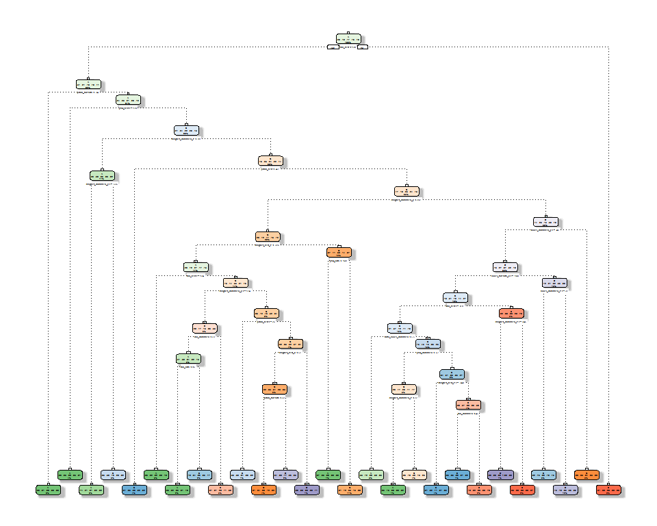

Weight Lifting Exercise
=======================

### Summary

Using devices such as *Jawbone Up*, *Nike FuelBand*, and *Fitbit* it is now possible to collect a large amount of data about personal activity relatively inexpensively. These type of devices are part of the quantified self movement - a group of enthusiasts who take measurements about themselves regularly to improve their health, to find patterns in their behavior, or because they are tech geeks. One thing that people regularly do is quantify *how much* of a particular activity they do, but they rarely quantify *how well* they do it.

### Exploratory Data Analysis

The data for this project come from this source: <http://groupware.les.inf.puc-rio.br/har>.

``` r
#Downloading files
URLtrain="https://d396qusza40orc.cloudfront.net/predmachlearn/pml-training.csv"
URLtest="https://d396qusza40orc.cloudfront.net/predmachlearn/pml-testing.csv"
download.file(URLtrain,destfile = "./train.csv")
download.file(URLtest,destfile="./test.csv")
```

Loading files:

``` r
training=read.csv(file="./train.csv",na.strings=c("NA","#DIV/0!",""))
testing=read.csv(file="./test.csv",na.strings=c("NA","#DIV/0!",""))
```

We have two diferent data sets: *train* and *test* set. The data have been extracted from this source: <http://groupware.les.inf.puc-rio.br/har> and it provides us data from accelerometers on the belt, forearm, arm, and dumbbell of 6 participants. They were asked to perform barbell lifts correctly and incorrectly in 5 different ways. This is the **classe** variable in the training set that we want to predict.

Some exploratory data analysis from cleaning training data set:

``` r
NAs=apply(training,2,function(x)sum(is.na(x))/length(x))#NAs percent by column

#Cleaning training and testing data set with, at least, 50% NAs
training=training[,NAs<0.5]
testing=testing[,NAs<0.5]

str(training)
```

    ## 'data.frame':    19622 obs. of  60 variables:
    ##  $ X                   : int  1 2 3 4 5 6 7 8 9 10 ...
    ##  $ user_name           : Factor w/ 6 levels "adelmo","carlitos",..: 2 2 2 2 2 2 2 2 2 2 ...
    ##  $ raw_timestamp_part_1: int  1323084231 1323084231 1323084231 1323084232 1323084232 1323084232 1323084232 1323084232 1323084232 1323084232 ...
    ##  $ raw_timestamp_part_2: int  788290 808298 820366 120339 196328 304277 368296 440390 484323 484434 ...
    ##  $ cvtd_timestamp      : Factor w/ 20 levels "02/12/2011 13:32",..: 9 9 9 9 9 9 9 9 9 9 ...
    ##  $ new_window          : Factor w/ 2 levels "no","yes": 1 1 1 1 1 1 1 1 1 1 ...
    ##  $ num_window          : int  11 11 11 12 12 12 12 12 12 12 ...
    ##  $ roll_belt           : num  1.41 1.41 1.42 1.48 1.48 1.45 1.42 1.42 1.43 1.45 ...
    ##  $ pitch_belt          : num  8.07 8.07 8.07 8.05 8.07 8.06 8.09 8.13 8.16 8.17 ...
    ##  $ yaw_belt            : num  -94.4 -94.4 -94.4 -94.4 -94.4 -94.4 -94.4 -94.4 -94.4 -94.4 ...
    ##  $ total_accel_belt    : int  3 3 3 3 3 3 3 3 3 3 ...
    ##  $ gyros_belt_x        : num  0 0.02 0 0.02 0.02 0.02 0.02 0.02 0.02 0.03 ...
    ##  $ gyros_belt_y        : num  0 0 0 0 0.02 0 0 0 0 0 ...
    ##  $ gyros_belt_z        : num  -0.02 -0.02 -0.02 -0.03 -0.02 -0.02 -0.02 -0.02 -0.02 0 ...
    ##  $ accel_belt_x        : int  -21 -22 -20 -22 -21 -21 -22 -22 -20 -21 ...
    ##  $ accel_belt_y        : int  4 4 5 3 2 4 3 4 2 4 ...
    ##  $ accel_belt_z        : int  22 22 23 21 24 21 21 21 24 22 ...
    ##  $ magnet_belt_x       : int  -3 -7 -2 -6 -6 0 -4 -2 1 -3 ...
    ##  $ magnet_belt_y       : int  599 608 600 604 600 603 599 603 602 609 ...
    ##  $ magnet_belt_z       : int  -313 -311 -305 -310 -302 -312 -311 -313 -312 -308 ...
    ##  $ roll_arm            : num  -128 -128 -128 -128 -128 -128 -128 -128 -128 -128 ...
    ##  $ pitch_arm           : num  22.5 22.5 22.5 22.1 22.1 22 21.9 21.8 21.7 21.6 ...
    ##  $ yaw_arm             : num  -161 -161 -161 -161 -161 -161 -161 -161 -161 -161 ...
    ##  $ total_accel_arm     : int  34 34 34 34 34 34 34 34 34 34 ...
    ##  $ gyros_arm_x         : num  0 0.02 0.02 0.02 0 0.02 0 0.02 0.02 0.02 ...
    ##  $ gyros_arm_y         : num  0 -0.02 -0.02 -0.03 -0.03 -0.03 -0.03 -0.02 -0.03 -0.03 ...
    ##  $ gyros_arm_z         : num  -0.02 -0.02 -0.02 0.02 0 0 0 0 -0.02 -0.02 ...
    ##  $ accel_arm_x         : int  -288 -290 -289 -289 -289 -289 -289 -289 -288 -288 ...
    ##  $ accel_arm_y         : int  109 110 110 111 111 111 111 111 109 110 ...
    ##  $ accel_arm_z         : int  -123 -125 -126 -123 -123 -122 -125 -124 -122 -124 ...
    ##  $ magnet_arm_x        : int  -368 -369 -368 -372 -374 -369 -373 -372 -369 -376 ...
    ##  $ magnet_arm_y        : int  337 337 344 344 337 342 336 338 341 334 ...
    ##  $ magnet_arm_z        : int  516 513 513 512 506 513 509 510 518 516 ...
    ##  $ roll_dumbbell       : num  13.1 13.1 12.9 13.4 13.4 ...
    ##  $ pitch_dumbbell      : num  -70.5 -70.6 -70.3 -70.4 -70.4 ...
    ##  $ yaw_dumbbell        : num  -84.9 -84.7 -85.1 -84.9 -84.9 ...
    ##  $ total_accel_dumbbell: int  37 37 37 37 37 37 37 37 37 37 ...
    ##  $ gyros_dumbbell_x    : num  0 0 0 0 0 0 0 0 0 0 ...
    ##  $ gyros_dumbbell_y    : num  -0.02 -0.02 -0.02 -0.02 -0.02 -0.02 -0.02 -0.02 -0.02 -0.02 ...
    ##  $ gyros_dumbbell_z    : num  0 0 0 -0.02 0 0 0 0 0 0 ...
    ##  $ accel_dumbbell_x    : int  -234 -233 -232 -232 -233 -234 -232 -234 -232 -235 ...
    ##  $ accel_dumbbell_y    : int  47 47 46 48 48 48 47 46 47 48 ...
    ##  $ accel_dumbbell_z    : int  -271 -269 -270 -269 -270 -269 -270 -272 -269 -270 ...
    ##  $ magnet_dumbbell_x   : int  -559 -555 -561 -552 -554 -558 -551 -555 -549 -558 ...
    ##  $ magnet_dumbbell_y   : int  293 296 298 303 292 294 295 300 292 291 ...
    ##  $ magnet_dumbbell_z   : num  -65 -64 -63 -60 -68 -66 -70 -74 -65 -69 ...
    ##  $ roll_forearm        : num  28.4 28.3 28.3 28.1 28 27.9 27.9 27.8 27.7 27.7 ...
    ##  $ pitch_forearm       : num  -63.9 -63.9 -63.9 -63.9 -63.9 -63.9 -63.9 -63.8 -63.8 -63.8 ...
    ##  $ yaw_forearm         : num  -153 -153 -152 -152 -152 -152 -152 -152 -152 -152 ...
    ##  $ total_accel_forearm : int  36 36 36 36 36 36 36 36 36 36 ...
    ##  $ gyros_forearm_x     : num  0.03 0.02 0.03 0.02 0.02 0.02 0.02 0.02 0.03 0.02 ...
    ##  $ gyros_forearm_y     : num  0 0 -0.02 -0.02 0 -0.02 0 -0.02 0 0 ...
    ##  $ gyros_forearm_z     : num  -0.02 -0.02 0 0 -0.02 -0.03 -0.02 0 -0.02 -0.02 ...
    ##  $ accel_forearm_x     : int  192 192 196 189 189 193 195 193 193 190 ...
    ##  $ accel_forearm_y     : int  203 203 204 206 206 203 205 205 204 205 ...
    ##  $ accel_forearm_z     : int  -215 -216 -213 -214 -214 -215 -215 -213 -214 -215 ...
    ##  $ magnet_forearm_x    : int  -17 -18 -18 -16 -17 -9 -18 -9 -16 -22 ...
    ##  $ magnet_forearm_y    : num  654 661 658 658 655 660 659 660 653 656 ...
    ##  $ magnet_forearm_z    : num  476 473 469 469 473 478 470 474 476 473 ...
    ##  $ classe              : Factor w/ 5 levels "A","B","C","D",..: 1 1 1 1 1 1 1 1 1 1 ...

``` r
table(training$classe)
```

    ## 
    ##    A    B    C    D    E 
    ## 5580 3797 3422 3216 3607

#### Data splitting

We are going to create a partition in the training dataset. 70% of the partition will be for calibrating the model and the rest of the data will be for testing.

``` r
library(caret)
```

    ## Loading required package: lattice

    ## Loading required package: ggplot2

``` r
inTrain=createDataPartition(y=training$classe,p=0.7,list=F)
myTraining=training[inTrain,]
myTesting=training[-inTrain,]

dim(myTraining); dim(myTesting)
```

    ## [1] 13737    60

    ## [1] 5885   60

#### Preaparing myTraining

Removing variables that are not predictors (columns from 1 to 7)

``` r
myTraining=myTraining[,8:dim(myTraining)[2]]
nzv=nearZeroVar(myTraining, saveMetrics = TRUE)
nzv
```

    ##                      freqRatio percentUnique zeroVar   nzv
    ## roll_belt             1.071756    8.12404455   FALSE FALSE
    ## pitch_belt            1.007299   12.11327073   FALSE FALSE
    ## yaw_belt              1.102564   13.14697532   FALSE FALSE
    ## total_accel_belt      1.053329    0.20382907   FALSE FALSE
    ## gyros_belt_x          1.077660    0.92451045   FALSE FALSE
    ## gyros_belt_y          1.140484    0.49501347   FALSE FALSE
    ## gyros_belt_z          1.079770    1.16473757   FALSE FALSE
    ## accel_belt_x          1.044776    1.15017835   FALSE FALSE
    ## accel_belt_y          1.099174    0.99730654   FALSE FALSE
    ## accel_belt_z          1.139456    2.12564607   FALSE FALSE
    ## magnet_belt_x         1.003876    2.19844216   FALSE FALSE
    ## magnet_belt_y         1.121076    2.06740919   FALSE FALSE
    ## magnet_belt_z         1.009063    3.10839339   FALSE FALSE
    ## roll_arm             52.400000   17.47834316   FALSE FALSE
    ## pitch_arm            94.360000   20.36834826   FALSE FALSE
    ## yaw_arm              33.211268   19.15993303   FALSE FALSE
    ## total_accel_arm       1.052464    0.47317464   FALSE FALSE
    ## gyros_arm_x           1.000000    4.57887457   FALSE FALSE
    ## gyros_arm_y           1.452247    2.67889641   FALSE FALSE
    ## gyros_arm_z           1.146479    1.69614909   FALSE FALSE
    ## accel_arm_x           1.026087    5.57618112   FALSE FALSE
    ## accel_arm_y           1.102740    3.80723593   FALSE FALSE
    ## accel_arm_z           1.010989    5.59801995   FALSE FALSE
    ## magnet_arm_x          1.000000    9.60908495   FALSE FALSE
    ## magnet_arm_y          1.016129    6.26046444   FALSE FALSE
    ## magnet_arm_z          1.083333    9.12863071   FALSE FALSE
    ## roll_dumbbell         1.170455   86.62735677   FALSE FALSE
    ## pitch_dumbbell        2.097087   84.40707578   FALSE FALSE
    ## yaw_dumbbell          1.157303   85.92851423   FALSE FALSE
    ## total_accel_dumbbell  1.040858    0.29846400   FALSE FALSE
    ## gyros_dumbbell_x      1.030952    1.69614909   FALSE FALSE
    ## gyros_dumbbell_y      1.241050    1.95821504   FALSE FALSE
    ## gyros_dumbbell_z      1.060890    1.39768508   FALSE FALSE
    ## accel_dumbbell_x      1.095023    2.97736041   FALSE FALSE
    ## accel_dumbbell_y      1.040936    3.29038364   FALSE FALSE
    ## accel_dumbbell_z      1.200000    2.90456432   FALSE FALSE
    ## magnet_dumbbell_x     1.022901    7.78918250   FALSE FALSE
    ## magnet_dumbbell_y     1.379310    5.93288200   FALSE FALSE
    ## magnet_dumbbell_z     1.036765    4.78270365   FALSE FALSE
    ## roll_forearm         12.021930   13.80941982   FALSE FALSE
    ## pitch_forearm        62.318182   19.02162044   FALSE FALSE
    ## yaw_forearm          14.978142   12.75387639   FALSE FALSE
    ## total_accel_forearm   1.113186    0.47317464   FALSE FALSE
    ## gyros_forearm_x       1.021739    2.06740919   FALSE FALSE
    ## gyros_forearm_y       1.014760    5.21220063   FALSE FALSE
    ## gyros_forearm_z       1.147590    2.11108685   FALSE FALSE
    ## accel_forearm_x       1.155172    5.67081604   FALSE FALSE
    ## accel_forearm_y       1.073529    7.10489918   FALSE FALSE
    ## accel_forearm_z       1.000000    4.04018345   FALSE FALSE
    ## magnet_forearm_x      1.125000   10.61367111   FALSE FALSE
    ## magnet_forearm_y      1.078125   13.33624518   FALSE FALSE
    ## magnet_forearm_z      1.024390   11.66921453   FALSE FALSE
    ## classe                1.469526    0.03639805   FALSE FALSE

### Algorithm

#### Decision Trees

``` r
library(rattle); library(rpart)
```

    ## Rattle: A free graphical interface for data mining with R.
    ## Versión 4.1.0 Copyright (c) 2006-2015 Togaware Pty Ltd.
    ## Escriba 'rattle()' para agitar, sacudir y  rotar sus datos.

``` r
set.seed(1124)

treeModel=rpart(classe ~ .,data=myTraining,method="class")
fancyRpartPlot(treeModel,sub="")
```



``` r
predictions1=predict(treeModel,newdata=myTesting,type="class")
confusionMatrix(predictions1,myTesting$classe)
```

    ## Confusion Matrix and Statistics
    ## 
    ##           Reference
    ## Prediction    A    B    C    D    E
    ##          A 1465  148   18   68   59
    ##          B   53  765   76   83   61
    ##          C   23  133  846  170  129
    ##          D  105   82   49  602   58
    ##          E   28   11   37   41  775
    ## 
    ## Overall Statistics
    ##                                           
    ##                Accuracy : 0.7567          
    ##                  95% CI : (0.7455, 0.7676)
    ##     No Information Rate : 0.2845          
    ##     P-Value [Acc > NIR] : < 2.2e-16       
    ##                                           
    ##                   Kappa : 0.6918          
    ##  Mcnemar's Test P-Value : < 2.2e-16       
    ## 
    ## Statistics by Class:
    ## 
    ##                      Class: A Class: B Class: C Class: D Class: E
    ## Sensitivity            0.8751   0.6716   0.8246   0.6245   0.7163
    ## Specificity            0.9304   0.9425   0.9064   0.9403   0.9756
    ## Pos Pred Value         0.8333   0.7370   0.6503   0.6719   0.8688
    ## Neg Pred Value         0.9494   0.9228   0.9607   0.9274   0.9385
    ## Prevalence             0.2845   0.1935   0.1743   0.1638   0.1839
    ## Detection Rate         0.2489   0.1300   0.1438   0.1023   0.1317
    ## Detection Prevalence   0.2987   0.1764   0.2211   0.1523   0.1516
    ## Balanced Accuracy      0.9028   0.8071   0.8655   0.7824   0.8460

#### Random Forests

``` r
library(randomForest)
```

    ## randomForest 4.6-12

    ## Type rfNews() to see new features/changes/bug fixes.

    ## 
    ## Attaching package: 'randomForest'

    ## The following object is masked from 'package:ggplot2':
    ## 
    ##     margin

``` r
rfModel=randomForest(classe ~ .,data=myTraining)

predictions2=predict(rfModel,newdata=myTesting)
confusionMatrix(predictions2,myTesting$classe)
```

    ## Confusion Matrix and Statistics
    ## 
    ##           Reference
    ## Prediction    A    B    C    D    E
    ##          A 1670    5    0    0    0
    ##          B    3 1129    5    0    0
    ##          C    0    5 1019    6    0
    ##          D    0    0    2  958    1
    ##          E    1    0    0    0 1081
    ## 
    ## Overall Statistics
    ##                                           
    ##                Accuracy : 0.9952          
    ##                  95% CI : (0.9931, 0.9968)
    ##     No Information Rate : 0.2845          
    ##     P-Value [Acc > NIR] : < 2.2e-16       
    ##                                           
    ##                   Kappa : 0.994           
    ##  Mcnemar's Test P-Value : NA              
    ## 
    ## Statistics by Class:
    ## 
    ##                      Class: A Class: B Class: C Class: D Class: E
    ## Sensitivity            0.9976   0.9912   0.9932   0.9938   0.9991
    ## Specificity            0.9988   0.9983   0.9977   0.9994   0.9998
    ## Pos Pred Value         0.9970   0.9930   0.9893   0.9969   0.9991
    ## Neg Pred Value         0.9990   0.9979   0.9986   0.9988   0.9998
    ## Prevalence             0.2845   0.1935   0.1743   0.1638   0.1839
    ## Detection Rate         0.2838   0.1918   0.1732   0.1628   0.1837
    ## Detection Prevalence   0.2846   0.1932   0.1750   0.1633   0.1839
    ## Balanced Accuracy      0.9982   0.9948   0.9955   0.9966   0.9994

### Predicting values in the test set

Random Forests algorithm is more accurate than Decision Trees algorithm. Random Forests gives us an accuracy of 99.64% in the testing set. So we are going to use this model for predicting values in the test set.

``` r
predictions3=predict(rfModel,testing)
predictions3
```

    ##  1  2  3  4  5  6  7  8  9 10 11 12 13 14 15 16 17 18 19 20 
    ##  B  A  B  A  A  E  D  B  A  A  B  C  B  A  E  E  A  B  B  B 
    ## Levels: A B C D E
